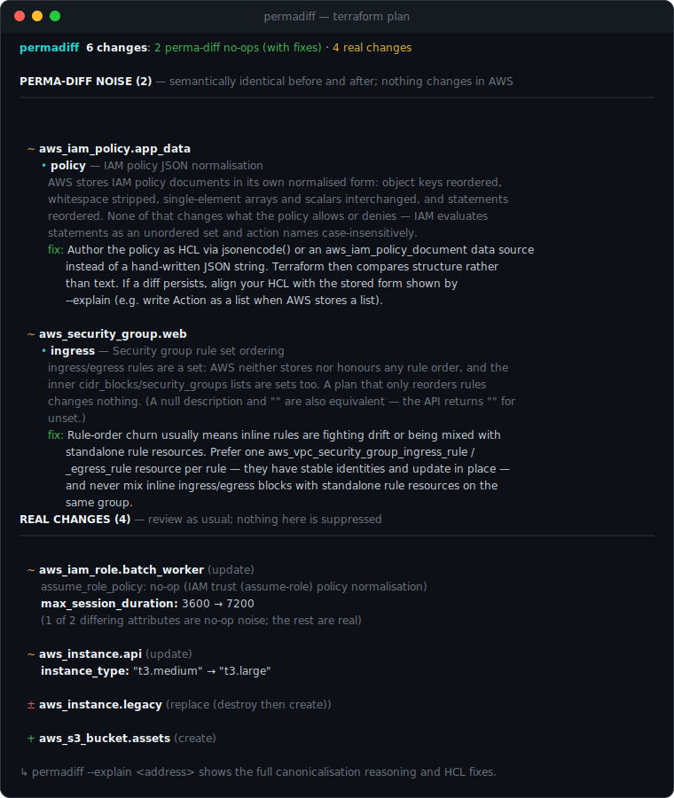

# permadiff

[](https://github.com/itsveems/permadiff/actions/workflows/ci.yml)

**Separate Terraform plan noise from real changes — and fix the noise at its source.**

<p align="center">
  
</p>

<sub>Reproduce this output: <code>permadiff examples/demo-plan.json</code></sub>

`permadiff` reads `terraform show -json` output and identifies **perma-diffs**:
update-in-place changes that are *not real changes* — artifacts of provider
normalisation, JSON reordering, type coercion, or formatting, where before and
after are semantically identical. For each one it explains **why** it's a no-op
and suggests the **correct fix**, so the diff disappears instead of getting
buried under a reflexive `ignore_changes`.

```
permadiff  6 changes: 2 perma-diff no-ops (with fixes) · 4 real changes

PERMA-DIFF NOISE (2) — semantically identical before and after; nothing changes in AWS
──────────────────────────────────────────────────────────────────────────────

  ~ aws_iam_policy.app_data
      • policy — IAM policy JSON normalisation
        AWS stores IAM policy documents in its own normalised form: object keys reordered,
        whitespace stripped, single-element arrays and scalars interchanged, and statements
        reordered. None of that changes what the policy allows or denies — IAM evaluates
        statements as an unordered set and action names case-insensitively.
        fix: Author the policy as HCL via jsonencode() or an aws_iam_policy_document data source
             instead of a hand-written JSON string. Terraform then compares structure rather
             than text. If a diff persists, align your HCL with the stored form shown by
             --explain (e.g. write Action as a list when AWS stores a list).

  ~ aws_security_group.web
      • ingress — Security group rule set ordering
        ingress/egress rules are a set: AWS neither stores nor honours any rule order, and the
        inner cidr_blocks/security_groups lists are sets too. A plan that only reorders rules
        changes nothing. (A null description and "" are also equivalent — the API returns "" for
        unset.)
        fix: Rule-order churn usually means inline rules are fighting drift or being mixed with
             standalone rule resources. Prefer one aws_vpc_security_group_ingress_rule /
             _egress_rule resource per rule — they have stable identities and update in place —
             and never mix inline ingress/egress blocks with standalone rule resources on the
             same group.

REAL CHANGES (4) — review as usual; nothing here is suppressed
──────────────────────────────────────────────────────────────────────────────

  ~ aws_iam_role.batch_worker (update)
      assume_role_policy: no-op (IAM trust (assume-role) policy normalisation)
      max_session_duration: 3600 → 7200
      (1 of 2 differing attributes are no-op noise; the rest are real)

  ~ aws_instance.api (update)
      instance_type: "t3.medium" → "t3.large"

  ± aws_instance.legacy (replace (destroy then create))

  + aws_s3_bucket.assets (create)

↳ permadiff --explain <address> <plan> shows the full canonicalisation reasoning and HCL fixes.
```

## Install

```sh
go install github.com/itsveems/permadiff/cmd/permadiff@latest
```

(Or clone and `make build`. Single static binary, no runtime dependencies.)

## Usage

```sh
terraform plan -out=plan.tfplan
terraform show -json plan.tfplan | permadiff        # read from stdin
terraform show -json plan.tfplan > plan.json
permadiff plan.json                                  # or from a file

permadiff --format=markdown plan.json                # GitHub PR comment body
permadiff --explain aws_iam_policy.app plan.json     # full reasoning + HCL fix for one resource
permadiff --catalog my-patterns.yaml plan.json       # extra patterns (take precedence)
```

`--explain` shows every pattern that was tried, the canonical form both sides
reduce to, and the complete fix with HCL before/after snippets.

## How it decides — and why you can trust it

For each in-place update, `permadiff` compares `before` and `after`
attribute by attribute and tries to **prove** the difference is cosmetic by
canonicalising both sides (sorting policy statements, treating set-semantic
lists as sets, coercing `"80"` vs `80`, normalising DNS names, …). Three rules
keep it honest:

1. **Prove it or it's real.** A change is labelled a no-op only when the
   canonicalised before and after are *identical*. Parse errors, unexpected
   shapes, anything ambiguous → real change. False negatives (missed noise)
   are acceptable; false positives are not, and the test suite guards every
   pattern with a look-alike real change that must stay real.
2. **Nothing is suppressed.** Every change in the plan is shown. The tool only
   adds explanation to the no-op quadrant; real changes are listed plainly and
   left alone.
3. **Confidence is explicit.** Only **high**-confidence findings are counted
   as noise in the headline. Medium-confidence findings (e.g. `tags_all`
   flipping to "known after apply", where one plan cannot prove the provider's
   `default_tags` didn't change) stay listed with the real changes, annotated.
   And when *every* differing attribute is a computed flip to "(known after
   apply)" — so there were no values to compare at all — the resource is
   capped at medium no matter what the catalog says.

A concrete example of how fine the line is: AWS lets a policy principal be
written as `"*"` or `{"AWS": "*"}`, and for an `Allow` statement those are the
same thing — a real perma-diff S3 produces for public buckets. But under a
`Deny` they are *not*: `"*"` denies everyone, including anonymous requests,
while `{"AWS": "*"}` denies only AWS account principals. So permadiff collapses
that rewrite only for `Allow`, and reports the `Deny` version as a real change —
the kind of asymmetry the "prove it or it's real" rule exists to catch.

It is fully **deterministic and offline**: rule-based against a YAML pattern
catalog. No network calls, no telemetry.

## Fix suggestions, in the right order

For every no-op the tool suggests a fix with this priority:

1. **Make your HCL match the canonical form** — wrap raw policy strings in
   `jsonencode()`, quote ECS environment values, drop `tags = {}`, fix the
   literal's type, write the Route 53 name the way AWS stores it. The diff
   disappears *and* future real changes stay visible.
2. **Only for irreducible provider-side churn** (e.g. some `default_tags`
   provider bugs) does it mention a narrowly scoped
   `lifecycle { ignore_changes = [<one attribute>] }` — always with an explicit
   warning that this masks future real changes to that attribute, and never
   for the whole resource.

Reflexive `ignore_changes` that hides real drift is the anti-pattern this tool
exists to replace. The tool suggests; it never edits your files.

## Pattern catalog (v1, AWS)

| # | Pattern | Catalog entries | Example |
|---|---------|-----------------|---------|
| 1 | IAM policy JSON normalisation (incl. trust policies) | `iam-policy-json`, `iam-assume-role-policy` | statement/action reordering, scalar↔list, account ID↔root ARN |
| 2 | S3 bucket policy JSON | `s3-bucket-policy-json` | `Principal: "*"` ↔ `{"AWS": "*"}` |
| 3 | KMS key policy JSON | `kms-key-policy-json` | bare account ID → root ARN |
| 4 | Other resource policies on the IAM grammar | `resource-policy-json` | SQS/SNS/ECR/Secrets Manager/CloudWatch Logs policies |
| 5 | Security group rule sets | `sg-inline-rules`, `sg-rule-cidr-sets` | rule + CIDR ordering; description ForceNew quirk (flagged) |
| 6 | `tags` / `tags_all` | `tags-empty-vs-null`, `tags-all-computed-churn` | `{}` vs `null`; `default_tags` churn (medium confidence) |
| 7 | ECS `container_definitions` | `ecs-container-definitions`, `ecs-task-definition-computed` | env ordering, API-injected defaults, value stringification |
| 8 | Type coercion | `generic-type-coercion` | `"80"` vs `80`, `"true"` vs `true` |
| 9 | Route 53 names | `route53-name-normalization`, `route53-record-computed` | case, trailing dot, `\052` wildcard escape |
| 10 | Set-semantic list attributes | `aws-set-semantic-lists` | `subnet_ids` / `security_groups` reordered |
| 11 | Computed-field churn | `generic-computed-churn` | `arn`/`id` → "(known after apply)" with nothing else changed |
| 12 | JSON-document attributes (curated) | `generic-json-attribute` | `definition`, `template_body`, `dashboard_body`, `event_pattern` formatting |

Pattern 12 deliberately applies only to a curated allowlist of attributes
where the service stores *parsed* JSON. Verbatim-bytes attributes
(`user_data`, `aws_ssm_parameter.value`, secret strings, …) are never
matched: those bytes are delivered as-is to a machine, so reformatted JSON is
a real change there.

The catalog lives in [patterns/catalog.yaml](patterns/catalog.yaml) and is
compiled into the binary; `--catalog` adds your own entries at runtime.

## Known limitations — what it does NOT do

- **AWS provider only (v1).** Other providers' resources are listed as real
  changes, untouched.
- **Seed catalog coverage.** Twelve well-documented pattern families (17
  catalog entries). Noise outside the catalog is reported as a real change —
  conservative by design.
- **Conservative by design.** It will miss noise (false negatives) rather than
  risk mislabelling a real change. If you find a missed pattern, contribute it.
- **Top-level attribute granularity.** Diffs are analysed per top-level
  attribute; a no-op is only declared when that entire attribute canonicalises
  equal.
- It does **not** rank dangerous changes (destroy/replace/force-new) — other
  tools own that. No downtime analysis, no security/compliance scanning, no
  cost estimation, and it never modifies your files.
- Reading `terraform show -json` output only — not state files, not raw
  `.tfplan` binaries, not HCL.

## Contributing a pattern

Most perma-diffs need **no Go code** — just YAML plus fixtures:

1. **Add an entry to `patterns/catalog.yaml`.** Pick the closest existing
   canonicalizer (`aws_policy_json`, `generic_json`, `set_list`, `sg_rules`,
   `scalar_coercion`, `dns_name`, `empty_collection`,
   `ecs_container_definitions`), write the `why` (plain English, it's shown to
   users) and the `fix` (real remediation first; `ignore_changes` only for
   irreducible churn, always with a `warning`).
2. **Add two fixtures** under `internal/classify/testdata/`: one plan where
   the diff is pure normalisation (must classify as noise), and one
   look-alike where the change is real (must classify as real). The real
   twin is mandatory — it's the false-positive guard.
3. **Add both to the table** in `internal/classify/classify_test.go` and run
   `make test`.

If the normalisation itself is new (a new canonicalisation *strategy*),
implement it in `internal/canon/` behind the same rule: **when in doubt, not
equal** — and register it with unit tests in both directions.

## Licence

MIT — see [LICENSE](LICENSE).
